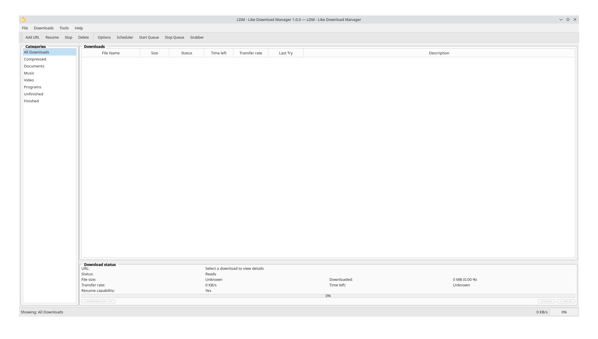

# LDM - Like Download Manager

[](https://github.com/aerab243/ldm)
[](LICENSE)
[](https://qt.io)
[](https://isocpp.org)
[](https://github.com/aerab243/ldm)

🚀 **A powerful, modern download manager with an Internet Download Manager (IDM) style interface, built with Qt 6 and C++20.**



## ✨ Features

### 🎯 Core Download Features
- **⚡ Multi-threaded Downloads**: Split files into segments for maximum speed
- **🔄 Resume Support**: Continue interrupted downloads seamlessly
- **⏸️ Pause/Resume**: Full control over download state
- **📊 Real-time Progress**: Live speed and progress monitoring
- **📁 Smart Organization**: Auto-categorize downloads by file type
- **🔗 URL Detection**: Automatic filename extraction from URLs

### 🎨 IDM-Style Interface
- **🖥️ Familiar Design**: Interface inspired by Internet Download Manager
- **📋 Complete Toolbar**: Add URL, Resume, Stop, Delete, Options, and more
- **📂 Category Panel**: Organize downloads (Music, Video, Documents, etc.)
- **📈 Detailed Progress**: Real-time transfer rates and ETA calculations
- **💾 Download History**: Track completed and failed downloads
- **🔍 Search & Filter**: Find downloads quickly

### 🛠️ Advanced Features
- **⏰ Download Scheduler**: Queue downloads for specific times
- **🎯 Queue Management**: Organize downloads with priorities
- **🕷️ Link Grabber**: Extract downloadable links from web pages
- **⚙️ Customizable Settings**: Configure connections, paths, and behavior
- **🔔 System Notifications**: Desktop alerts for completed downloads
- **📱 System Tray**: Minimize to tray with quick access menu

### 🔧 Technical Features
- **🏗️ Modern C++20**: Latest language standards and best practices
- **🎨 Qt 6 Framework**: Cross-platform native GUI
- **🌐 libcurl Integration**: Reliable HTTP/HTTPS download engine
- **🔒 OpenSSL Support**: Secure connections and encryption
- **📊 SQLite Database**: Efficient download history storage
- **🚀 Multi-threading**: Concurrent downloads and UI responsiveness

## 📦 Quick Start

### 🐧 Linux (Ubuntu/Debian)

```bash
# Install dependencies
sudo apt update
sudo apt install build-essential qt6-base-dev qt6-tools-dev cmake
sudo apt install libcurl4-openssl-dev libssl-dev

# Clone and build
git clone https://github.com/aerab243/ldm.git
cd ldm/desktop
make -f Makefile.complete
./ldm-complete
```

### 🎯 Fedora/RHEL

```bash
# Install dependencies
sudo dnf install gcc-c++ make qt6-qtbase-devel qt6-qttools-devel
sudo dnf install libcurl-devel openssl-devel

# Clone and build
git clone https://github.com/aerab243/ldm.git
cd ldm/desktop
make -f Makefile.complete
./ldm-complete
```

### 🏗️ Arch Linux

```bash
# Install dependencies
sudo pacman -S gcc make qt6-base qt6-tools curl openssl

# Clone and build
git clone https://github.com/aerab243/ldm.git
cd ldm/desktop
make -f Makefile.complete
./ldm-complete
```

### 🛠️ Auto-Setup

```bash
git clone https://github.com/aerab243/ldm.git
cd ldm/desktop
make -f Makefile.complete setup  # Auto-detects distro and installs deps
```

## 📖 Usage Guide

### 🚀 Getting Started

1. **Launch LDM**: Run `./ldm-complete` or install with `make install`
2. **Add Downloads**: Click "Add URL" or press `Ctrl+N`
3. **Configure Settings**: Access via "Options" for customization
4. **Manage Downloads**: Use toolbar buttons for control

### 💡 Key Features

#### 📥 Adding Downloads
- **Single URL**: Click "Add URL" and paste the download link
- **Batch URLs**: Use Link Grabber to extract multiple links
- **Auto-detection**: Filename and category detected automatically
- **Custom Settings**: Configure connections, save path, and priority

#### ⚡ Download Control
- **Start/Resume**: Begin or continue downloads
- **Pause**: Temporarily stop downloads (can resume later)
- **Stop**: Permanently halt downloads
- **Delete**: Remove downloads from list (optionally delete files)

#### 📊 Monitoring
- **Real-time Progress**: See speed, ETA, and completion percentage
- **Global Statistics**: Overall download speed and progress
- **History Tracking**: View completed and failed downloads

### 🔧 Advanced Usage

#### ⏰ Scheduling Downloads
```
Tools → Scheduler → Add Schedule
```
- Set specific start times for downloads
- Configure recurring download schedules
- Manage bandwidth during peak hours

#### 🎯 Queue Management
```
Tools → Queue Manager
```
- Create custom download queues
- Set priority levels (High, Normal, Low)
- Control concurrent download limits

#### 🕷️ Link Grabbing
```
Tools → Link Grabber
```
- Extract all downloadable links from web pages
- Filter by file type and size
- Bulk add to download queue

## ⚙️ Configuration

### 🔧 Settings Overview

#### 📁 General Settings
- **Download Directory**: Default save location
- **Max Connections**: Number of simultaneous connections per download
- **Auto-start**: Begin downloads immediately after adding

#### 🌐 Network Settings
- **Speed Limit**: Bandwidth throttling (KB/s)
- **Timeout**: Connection timeout duration
- **Proxy Support**: HTTP/SOCKS proxy configuration

#### 🎨 Interface Settings
- **Theme**: Light, Dark, or Classic IDM styling
- **Notifications**: Desktop alerts for events
- **Tray Integration**: Minimize to system tray

### 📝 Configuration Files

```
~/.config/LDM/
├── settings.conf       # Main configuration
├── downloads.db        # Download history
└── categories.conf     # Custom categories
```

## 🏗️ Building from Source

### 📋 Prerequisites

**Required Dependencies:**
- Qt 6.5+ (Core, Widgets, Network)
- C++20 compatible compiler (GCC 10+, Clang 12+)
- libcurl 7.60+
- OpenSSL 1.1+
- CMake 3.20+ (optional)

**Development Tools:**
- MOC (Meta-Object Compiler)
- pkg-config
- make

### 🔨 Build Options

#### 🚀 Quick Build (Makefile)
```bash
cd ldm/desktop
make -f Makefile.complete          # Release build
make -f Makefile.complete debug    # Debug build
make -f Makefile.complete test     # Run tests
```

#### 🏗️ CMake Build
```bash
cd ldm/desktop
mkdir build && cd build
cmake -DCMAKE_BUILD_TYPE=Release ..
make -j$(nproc)
```

#### 🎯 IDM-Style Interface Only
```bash
cd ldm/desktop
make -f Makefile.idm               # Lightweight UI demo
```

### 📦 Installation

```bash
# System-wide installation
sudo make -f Makefile.complete install

# Package creation
make -f Makefile.complete package

# Uninstall
sudo make -f Makefile.complete uninstall
```

## 🏗️ Project Structure

```
ldm/
├── desktop/                    # Main application
│   ├── src/
│   │   ├── main_complete.cpp  # Complete application
│   │   ├── main_idm.cpp       # IDM-style interface demo
│   │   ├── core/              # Download engine
│   │   ├── ui/                # User interface components
│   │   ├── api/               # REST API server
│   │   └── utils/             # Utility functions
│   ├── resources/             # Icons and assets
│   ├── tests/                 # Unit tests
│   └── Makefile.*             # Build configurations
├── browser-extension/          # Web browser integration
├── native-messaging/          # Browser communication
├── docs/                      # Documentation
├── scripts/                   # Utility scripts
└── installer/                 # Installation packages
```

## 🎮 Interface Overview

```
┌─────────────────────────────────────────────────────────────┐
│ File  Downloads  Tools  Help                    [_] [□] [×] │
├─────────────────────────────────────────────────────────────┤
│ [Add URL] [Resume] [Stop] [Delete] │ [Options] [Scheduler]  │
├───────────────┬─────────────────────────────────────────────┤
│ 📁 Categories │ Downloads Table                             │
│ 📦 Compressed │ ┌─────────────────────────────────────────┐ │
│ 📄 Documents  │ │File Name │Size │Status │Speed │Progress│ │
│ 🎵 Music      │ ├─────────────────────────────────────────┤ │
│ 🎬 Video      │ │video.mp4 │1GB  │45%    │2MB/s │████░░░│ │
│ ⚙ Programs    │ │song.mp3  │5MB  │100%   │Done  │██████│ │
│ ✓ Finished    │ │doc.pdf   │2MB  │Queue  │Wait  │      │ │
│ ⏳ Queue       │ └─────────────────────────────────────────┘ │
├───────────────┴─────────────────────────────────────────────┤
│ Download Details                                            │
│ URL: https://example.com/video.mp4                          │
│ Status: Downloading (45%) │ Speed: 2.1 MB/s │ ETA: 5 min    │
│ [████████████░░░░░░░] 45% │ Size: 450/1000 MB              │
│ [Show Details] [Pause] [Cancel]                            │
├─────────────────────────────────────────────────────────────┤
│ Ready - 3 downloads active │ Total: 3.2 MB/s │ [██░] 67%   │
└─────────────────────────────────────────────────────────────┘
```

## 🎯 Roadmap

### 🚀 Version 1.1.0 (Next Release)
- [ ] **Browser Extension**: Chrome/Firefox integration
- [ ] **Advanced Scheduling**: Recurring downloads
- [ ] **Bandwidth Management**: Time-based speed limits
- [ ] **Download Verification**: Checksum validation
- [ ] **Plugin System**: Extensible architecture

### 🌟 Version 7.0 (Future)
- [ ] **Cloud Sync**: Cross-device download sync
- [ ] **Mobile App**: Android/iOS companion
- [ ] **Torrent Support**: BitTorrent protocol
- [ ] **Media Conversion**: Built-in format conversion
- [ ] **Remote API**: Web-based control panel

### 🔮 Long-term Vision
- [ ] **AI-powered Downloads**: Smart categorization
- [ ] **Streaming Integration**: YouTube, Netflix support
- [ ] **Enterprise Features**: Centralized management
- [ ] **Protocol Support**: FTP, SFTP, WebDAV

## 🤝 Contributing

We welcome contributions! Here's how to get started:

### 🐛 Bug Reports
1. Check existing issues on GitHub
2. Provide detailed reproduction steps
3. Include system information and logs
4. Add screenshots if applicable

### ✨ Feature Requests
1. Search existing feature requests
2. Describe the use case clearly
3. Explain expected behavior
4. Consider implementation complexity

### 💻 Code Contributions
1. **Fork** the repository
2. **Create** a feature branch: `git checkout -b feature/amazing-feature`
3. **Follow** coding standards (see CONTRIBUTING.md)
4. **Write** tests for new functionality
5. **Commit** with clear messages: `git commit -m 'Add amazing feature'`
6. **Push** to your branch: `git push origin feature/amazing-feature`
7. **Create** a Pull Request

### 📝 Code Style
- **C++20** modern standards
- **Qt** naming conventions
- **Google** C++ style guide
- **Doxygen** documentation
- **Unit tests** for new features

## 📄 License

This project is licensed under the **MIT License** - see the [LICENSE](LICENSE) file for details.

```
MIT License

Copyright (c) 2024 aerab243 (Anna-el Gerard RABENANDRASANA)

Permission is hereby granted, free of charge, to any person obtaining a copy
of this software and associated documentation files (the "Software"), to deal
in the Software without restriction, including without limitation the rights
to use, copy, modify, merge, publish, distribute, sublicense, and/or sell
copies of the Software, and to permit persons to whom the Software is
furnished to do so, subject to the following conditions:

The above copyright notice and this permission notice shall be included in all
copies or substantial portions of the Software.

THE SOFTWARE IS PROVIDED "AS IS", WITHOUT WARRANTY OF ANY KIND, EXPRESS OR
IMPLIED, INCLUDING BUT NOT LIMITED TO THE WARRANTIES OF MERCHANTABILITY,
FITNESS FOR A PARTICULAR PURPOSE AND NONINFRINGEMENT. IN NO EVENT SHALL THE
AUTHORS OR COPYRIGHT HOLDERS BE LIABLE FOR ANY CLAIM, DAMAGES OR OTHER
LIABILITY, WHETHER IN AN ACTION OF CONTRACT, TORT OR OTHERWISE, ARISING FROM,
OUT OF OR IN CONNECTION WITH THE SOFTWARE OR THE USE OR OTHER DEALINGS IN THE
SOFTWARE.
```

## 🙏 Acknowledgments

- **Internet Download Manager**: Interface design inspiration
- **Qt Project**: Excellent cross-platform framework
- **libcurl**: Robust networking library
- **OpenSSL**: Secure communication protocols
- **SQLite**: Embedded database engine
- **Developer**: aerab243 (Anna-el Gerard RABENANDRASANA)
- **Contributors**: Everyone who helped build LDM

## 📞 Support

### 💬 Community Support
- **GitHub Issues**: [Report bugs](https://github.com/aerab243/ldm/issues)
- **Discussions**: [Ask questions](https://github.com/aerab243/ldm/discussions)
- **Wiki**: [Documentation](https://github.com/aerab243/ldm/wiki)

### 📧 Contact
- **Email**: aerabenandrasana@gmail.com
- **Developer**: aerab243 (Anna-el Gerard RABENANDRASANA)

### 💼 Professional Support
- **Commercial Licensing**: Available for enterprise use
- **Custom Development**: Tailored solutions
- **Support Contracts**: Priority assistance

## 🌟 Star History

[](https://star-history.com/#aerab243/ldm&Date)

## 📊 Statistics


---

<div align="center">
  <h3>🚀 Built with ❤️ by aerab243</h3>
  <p><em>"Download management, IDM-style, but better."</em></p>
  
  [⭐ Star this repo](https://github.com/aerab243/ldm) • 
  [🐛 Report Bug](https://github.com/aerab243/ldm/issues) • 
  [✨ Request Feature](https://github.com/aerab243/ldm/issues) • 
  [💬 Join Community](https://github.com/aerab243/ldm/discussions)
</div>